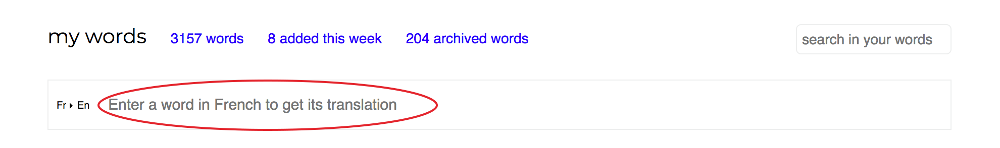
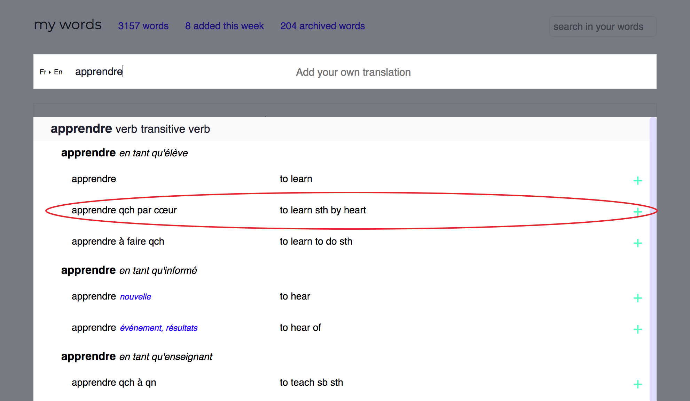
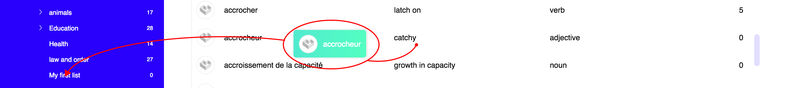
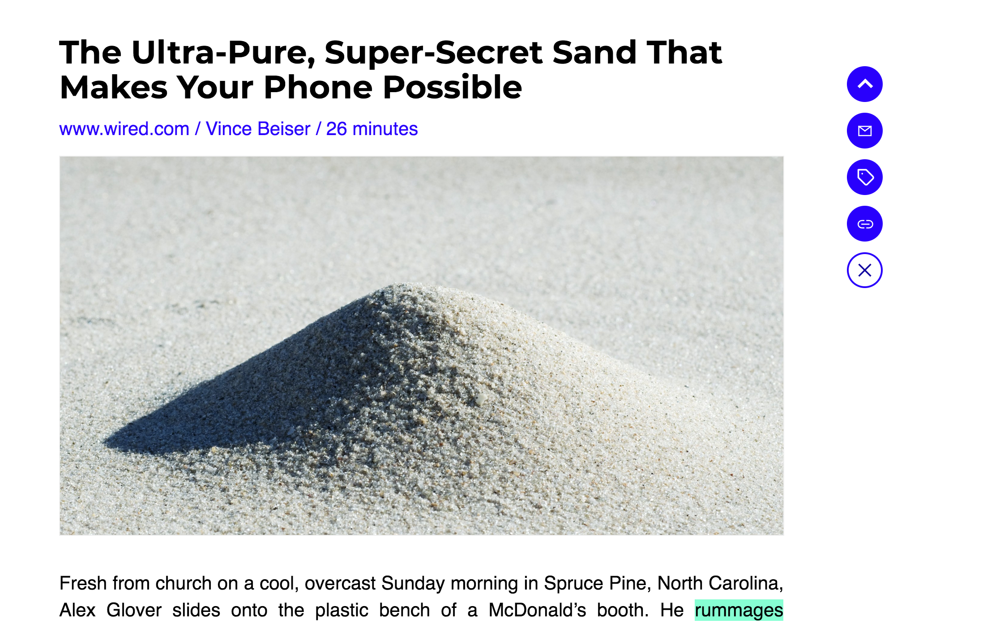
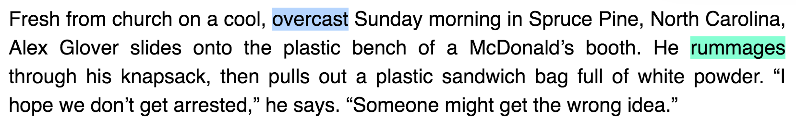
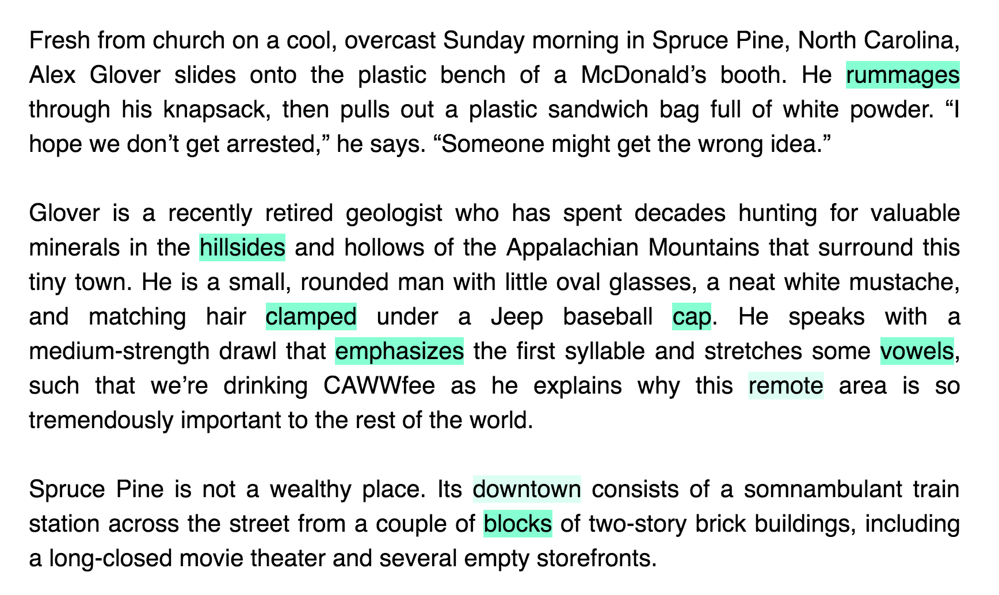
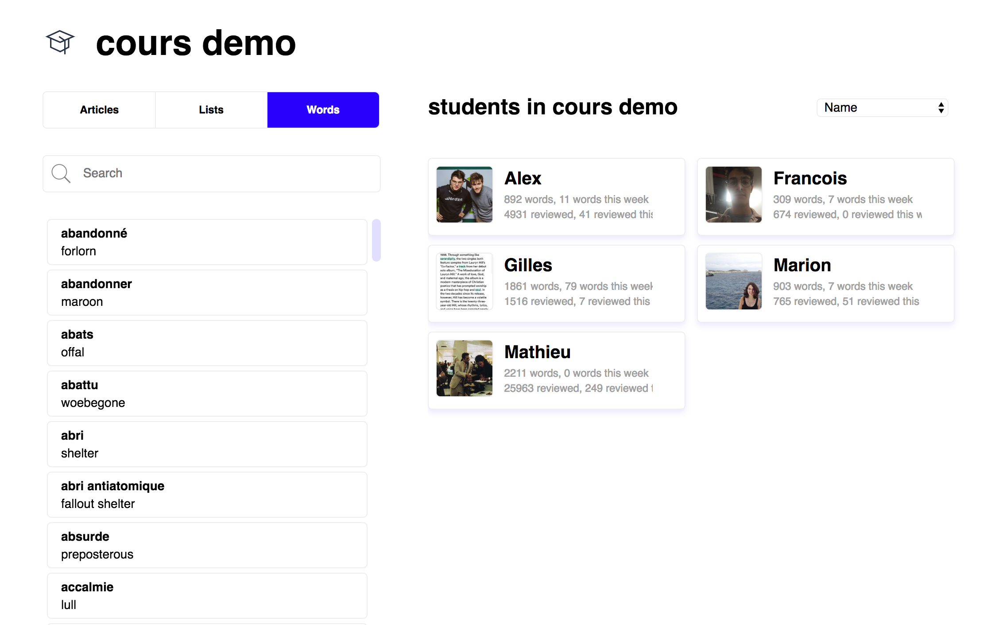
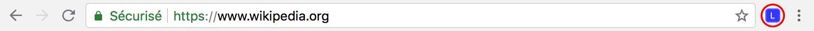
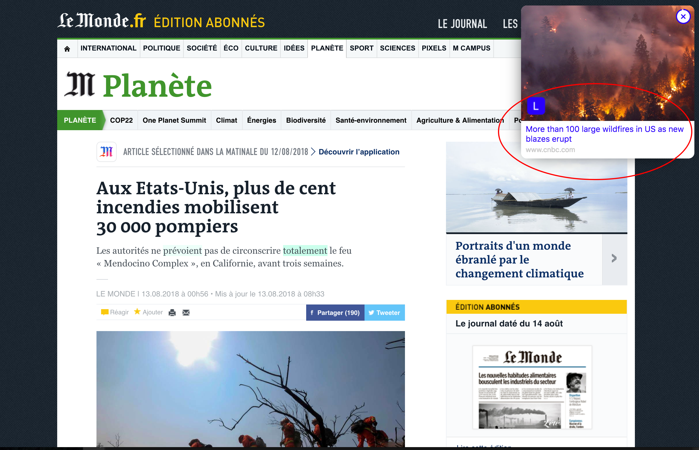

# Languages.ai's documentation

Welcome to Languages.ai's documentation. :wave:

# Languages.ai 101

We know that getting used to a new tool can take some time, so we'll walk you through the core concepts you need to know to get up and running with Languages.ai in no time.

!> :bulb: __tip__   If you have any question or difficulty, please [reach out to us](mailto:hello@languages.ai). We’re always happy to help. :heart:

## What is Languages.ai?

**Languages.ai** is a language learning tool that focuses on reading to improve your languages skills and grow your vocabulary.
In a word, it helps you find content adapted to your level and interests and gives you the opportunity to acquire the words you don't know and to build your personal lexicon.

#### Who is Languages.ai made for?

**Languages.ai** is for people having intermediary to very advanced level. On the [CEFR](https://en.wikipedia.org/wiki/Common_European_Framework_of_Reference_for_Languages ":ignore title") scale, our users need to be at least B1. Indeed, our users need to be able to go through easy natural texts without too much difficulty to have any interest using our solution. 

# Quick start

## Sign up

First thing you will need to use Languages.ai is an account on the platform. You can register [here](https://www.languages.ai/#signup-or-login ":ignore title") with your email address and username.
You will have to enter your mother tongue and the language you want to improve in. 

*If you already have an account, [log in](https://www.languages.ai/ ":ignore title"). if you have forgotten your password, [reset it](https://www.languages.ai/ ":ignore title"). *

## Tour of the platform

*Languages.ai comes with several parts, let's start with our web platform. On it, you can find and organize all your words, lists and articles. You can also review your words one by one or while reading your articles.*

### Words

#### Add a Word

First, you need to enter the word you need to translate.

#### Choose the translation direction

If you prefer to start from your learning language instead of your mother tongue, click on the translation direction e.g `En>Fr` to switch it.

#### Add your own translation

When you have entered a word, its translations will be displayed below. Click on the line corresponding to the translation you would like to learn to save it to you account. You can save as much translations as you want. 

If you are not happy with the provided translations, you can add your own by clicking on `Add your own translation` input: 

Once you have entered your translation, hit the `Enter` key to save it. 

#### Sort your words

To sort your words, click on the column title you want your words sorted by. Click again to have a descending sort.

#### Go to your words

If you are on any page of the website and want to go back to your words, click on `WORDS` in the sidebar on the left:

### Review your words

*Reviewing your words will help you acquire them in the long run so you can understand them when you come across them and so you can use them while your write and talk.*

#### Go to the reviewing part

If you have words to review, a button will appear on the top of your screen, click on it to review your words.

#### Review a word

To review a word, spell its translation in the input below it. 

!> :bulb: __tip__   The input width is matching the width of the expected translation so you can figure out which particular translation we want you to give. Here `rigid` or `stiff` would be too short, on the contrary its figurative sense `hidebound` fits in so it must be the expected translation.  

#### Reviewing options

Below the input, you can see multiple options:

* the `pencil` :pencil2:  icon enables you to edit the words you learn, it is only available when you have reviewed it and got the answer.

* the `left and right arrows` :left_right_arrow: icon enables you to switch the language, to review from your learning language instead of from your mother tongue.

* the `buoy` :o: icon gives you the first and last letter of the word to hint you towards its translation. 

 
*Must be `springboard` then...*

* the `eye` :eyes: icon will hide the level-0-words, if you don't want to see them while you review.

|  |  |
| --- | --- |
| **visible** :speak_no_evil: | **hidden** :see_no_evil: |

 

* the `twisted arrows` :twisted_rightwards_arrows: icon will switch to `random mode`, it means words won't appear according to our space-repetition algorithm but randomly.

* the `bin` :put_litter_in_its_place: icon will delete the word your are reviewing (either because you know it already or just because you feel like it).

*When possible, clicking again on an option will reverse its behavior.*

#### Reviewing sessions stats

The green line tells you what amount of the words you have reviewed. The closer from the right edge, the closer from the end of the session.

The percentage in the blue bubble gives you your success rate.

#### About our level system
 
?> :information_desk_person: __info__  Words comes with a level spanning from 0 (unknown) to 5 (mastered). The level of a word corresponds to how well you know it and is determined by your previous reviews. Each time you spell a word right, its level increments; each time you spell it wrong, it goes down. The more you know a word, the less you need to review it; thus, our spaced-repetition algorithm will insist on the words you know the least and well-known words will be shown less during your reviewing sessions.

### Lists

*Lists are here to help you organize your words.*

#### Create a list

To create a list, click on the `Lists` as shown in the following image:

1. Give it a name 
2. Click on `Create list`

Great, you have your first.

#### Go to a list

Your newly created list shoud have appear under `Lists` in your menu. For now, it has zero word. Click on its name to go to your list.

#### Populate a list

##### From the list

Rings a bell? It looks just like when you are on you words. And it works in the same way, except this time the words you add are saved not only in all your words but also in the list you are in. 

##### From your existing words

*You can also add existing words to a list directly from you existing words.*

###### Drag and drop a word

To do so, click on the word you want to put in a list and drag and drop it on the list you want it in by holding your click and moving your cursor.
The name of the list where it will be drop will slightly move, telling you you are on the right one. 

###### Drag and drop multiple words

You can also drag and drop multiple words at a time. To select a word, click on its line, it will become shaded.

Once you have selected all the words you want to put in a list, click on any word and drag and drop it over the given list just as explained in the previous point:

To unselect a word, click on its line again.

#### Review a list

Much like when you want to review all your words, you have a button `REVIEW THIS LIST` when you are on a list page. Click on it to review this specific list

#### More things you can do with your lists

##### List options

When on a list page, you have some options next to the list name:

* the `pencil` :pencil2: icon is for renaming the list.

* the `lists` :clipboard: icon is for creating a sublist (this one is for you, organization freaks).

* the `bin` :put_litter_in_its_place: icon is for deleting the given list. Use with caution.

##### Contextual menu

When you are in the left sidebar, right-clicking on a list name shows you a quite self-explanatory contextual menu:

As all actions are quite explicit, we won't go further in detail here.

##### Drag and drop for lists

Just like you can drop words in lists, you can drop lists in lists to merge them or nest them.

When dropping a list onto another one, you will see this modal: 

* **Merging** means that `Society` words will be included in `Politics`, if you want you can rename `Politics` after this. 

* **Nesting** means that `Society` will become a sublist of `Politics`.

### Articles

*The articles part is here to store articles in your learning language that might be of interest for you.*

#### Go to the articles part

You can find your articles part in the sidebar menu:

#### Add articles

To add an article, click on `Add`.

Then past the link of the article you want to add and press enter:

Your articles has been added.

#### Read your articles

Click on the title or on the thumbnail to go to the zen-mode and read the article

Here you are, reading the article you have previously saved from our website: 

##### Translate words while you read

Now, imagine you are reading and you come across a word you don't know, for instance `overcast` on the first line:

?> :information_desk_person: __info__  In case you didn't notice, all this documentation is taking the example of a French person learning English. If your mother tongue is English, feel free to do the transposition :flushed:

To translate it, double-click on it or click and hold while you drag your cursor over the group of words you would like to translate, just like that:

| It will trigger the translator: | If you want to save one of the translation, click on it:|
| --- | --- |
|  |  |

 

You still have the possibility to add your own translation. Remember ? Just put your translation on the input aptly named and press enter.

##### Review on your articles

If you already have some words saved, chances are that some of the words of the articles appear to be highlighted in some flashy green, just like this:

These words are the ones you are learning and you need to review. Let's click on `rummages` to review it.

?> :information_desk_person: __info__  Some of the words in the previous text are derivative forms of a verb (e.g. `rummages` or `clamped`), some are plural forms of a noun (e.g. `hillsides`, `vowels`). In fact, when you translate a form of a verb or of a noun, we usually yield you the translation of its infinitive/singular form but then we highlight all the different forms you can come across while browsing the web. This way you don't miss out on an opportunity to review one of your due words. In the exercises, we usually ask you the infinitive/singular form, here `rummage` for `rummages`. Also we try to only highlight your words only when they are in the right context which means that we take into account the part of speech of the words you learn: if you learn a word as a verb and it is used as the adjective in a sentence you come across, it won't be highlighted.

?> :information_desk_person: __info__  Some of the words such as `remote` or `downtown` are highlighted in a lighter way. This means you are learning them but you don't have to review them right now according to our algorithm. Get a reminder of their meaning with a mouseover.

### Visit other users' profile

If you know some of your friends username you can search for them and go to their account page:

There, you will be able to find and copy their words and lists.

#### Add their words

You can copy a word from a user by clicking on the green cross on the right of its line. Also, in the same way as you put your words in your lists, you can select their words and drag and drop them to your own lists.

#### Copy their lists

To see what's inside a list, click on its name. If you deem it good enough to be added, hover over its name with your cursor: a icon meaning `copy this list` appears. Click on it. job done.

#### Drag and drop

Also, in the same way as you can put words in your lists, you can select words dans drag and drop them to your own lists. Finally, you can also merge or nest a list from another user by dropping it on one of your lists.  

### Languages.ai for teachers and classes

#### Teacher account

*Teacher accounts are specific accounts that let teachers share their content (articles, list and words) with their students and enable them to monitor their students' progress.*

If you have a teacher account, you will be able to see the classes you are in charge of below your lists:

If you want to see all your classes, click on `CLASSES`. If you want to see students from a specific class, click on its name.

When you click on `CLASSES`, you land on a sharing panel:

You can choose what kind of thing you would like to share by clicking on one of the tabs:

And then, again, the good old drag-and-drop will let you share articles/lists/words with a group.

When you click on one of the groups, you can share content with specific students and see what they have been doing on the platform:

#### Student account

*Users who are in a class can share their content with their classmates.*

To share a list, right-click on its name and click on `share list`, you will then have to choose if you want to share it with the whole class or with specific classmates, if as a student you send something to the whole class, your teacher will also be able to receive it. 

In the same way, you can select words and share them with you class: click on all the words you would like to share then right-click on any selected word and click on `share these words`.

# Extensions

## Installing the extension

*Our extension is available on Chrome, Firefox and Safari*

If you haven't installed our extension yet, here are the links where you can get it: 

[Get it for Chrome](https://chrome.google.com/webstore/detail/languagesai-extension/ocjbabgnfnblhgpddnnlhccmihnlombj ":ignore title") - [Get it for Firefox](https://addons.mozilla.org/fr/firefox/addon/languages-ai-extension/ ":ignore title") - [Get it for Safari](https://safari-extensions.apple.com/details/?id=www.languages.ai-Q6TC99QXA7 ":ignore title")

When you have it installed, it should appear on your toolbar. Here is an example on Chrome, if the icon is here and not greyed that means it is installed and that you are connected to your account:

## Translation

Clicking on the icon will open the translator on any webpage and let you translate anything you want:

 * if you click on the arrow down icon :arrow_down_small: next to your learning language, you can change the language you are currently translating in. You can only choose one of the languages your have added on the platform. 

 * if you click on the left and right arrow icon :left_right_arrow:, you reverse the translation languages (i.e. starting from you learning language instead of your mother tongue).

 * if you already have lists, prior to saving a word, you can choose a list you would like to put the word in by clicking on `No list selected` and selecting one of your lists.

 * clicking on the bookmark icon, on the top right of the translator, will save the webpage to your "articles".

 * clicking on the sound icon :sound: will let you listen to the word you are translating.

The translations, highlightings, and reviewing processes works in the same way as [in the article part](?id=translate-words-while-you-read) of the web platform.

## Recommendation

Sometimes, when you read content in your mother tongue, we will recommend you pages in your learning language so you can read things that matter to you while improving your skills. 

A little pop-in window will open into your tab. Click on it to open the article in a new tab. 

!> :bulb: __tip__   If you would like to change some of the behaviors of the extension, you can access its options pages by right-clicking on the icon and clicking on `Options` 

