# Documentation de Languages.ai

Bienvenue sur la documentation de Languages.ai :wave:

# Introduction

On sait que prendre en main un nouvel outil peut parfois prendre du temps, on va vous accompagner pour vous présenter les concepts principaux dont vous avez besoin pour bien commencer avec Languages.ai.

!> :bulb: __Astuce__   Si vous avez la moindre difficulté, n'hésitez pas à nous [contacter](mailto:hello@languages.ai). On est toujours ravi à l'idée de vous être utile. :heart:

## Languages.ai, c'est quoi ?

**Languages.ai**, c'est un outil de perfectionnement en langue qui se concentre sur le temps que vous passez à lire sur internet afin de vous permettre d'accroître vos compétences et votre vocabulaire.
En deux mots, on vous aide à trouver les contenus adaptés à vos centres d'intérêt et à votre niveau pour vous permettre d'acquérir les mots dont vous aurez besoin dans le futur.

#### Pour qui est fait Languages.ai ?

**Languages.ai** cible les niveaux intermédiaires et avancés. Sur l'échelle du [CECR](https://www.coe.int/fr/web/common-european-framework-reference-languages ":ignore title"), cela correspond aux niveau B1 et plus. En effet, nos utilisateurs doivent être capables de parcourir sans trop de difficultés des textes simples dans leur langue d'apprentissage s'ils veulent pouvoir trouver un intérêt à la solution. 

# Pour commencer

## L'inscription

La première chose dont vous aurez besoin pour utiliser languages est un compte sur la plateforme. 
Vous pouvez vous inscrire [ici](https://www.languages.ai/#signup-or-login ":ignore title") avec votre email et un nom d'utilisateur.
Vous devrez renseigner votre langue natale et la langue dans laquelle vous désirez vous améliorer. 

*Si vous avez déjà un compte, [connectez-vous](https://www.languages.ai/ ":ignore title"). Si vous avez oublié votre mot de passe, [réinitialisez-le](https://www.languages.ai/ ":ignore title").*

## Visite de la plateforme

*Languages.ai est fait de nombreuses parties. Commençons avec la plateforme web. Dessus, vous pouvez retrouver et organiser vos mots, listes et articles. Vous pouvez aussi réviser vos mots un par un ou via vos articles enregistrés.*

### Les mots

#### Ajouter un mot

Vous devez commencer par saisir le mot que vous souhaitez traduire.

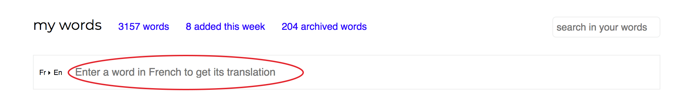

#### Choisissez votre sens de traduction

Si vous préférez partir de votre langue d'apprentissage plutôt que de votre langue maternelle, cliquez sur le sens de traduction (e.g `En>Fr`)
pour l'inverser.

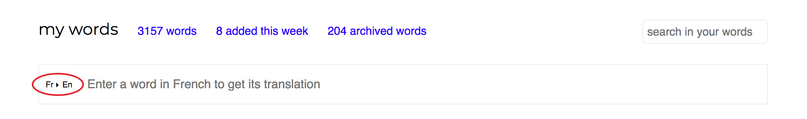

#### Ajoutez votre propre traduction

Quand vous avez saisi un mot, ses traductions apparaissent dessous. Cliquez sur la ligne correspondant à l'acception que vous désirez apprendre pour l'enregistrer. Vous pouvez enregistrer toutes les traductions que vous voulez. 

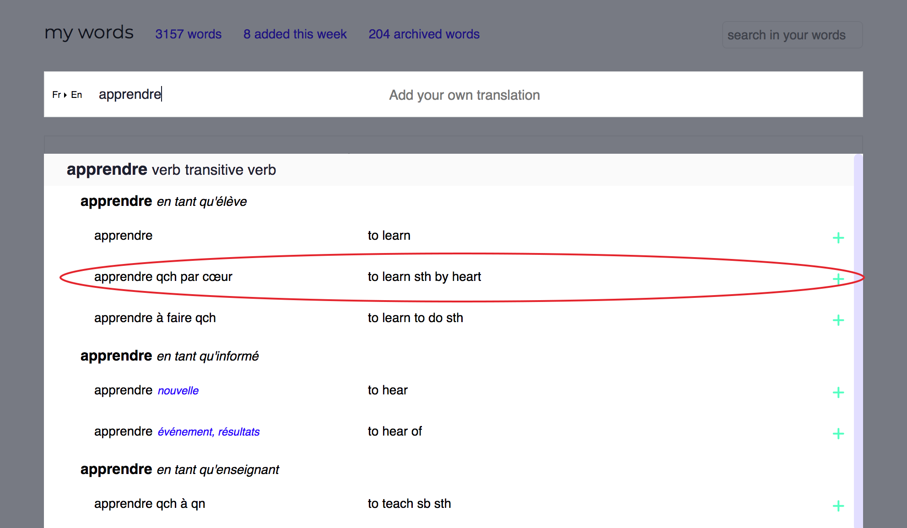

Si vous n'êtes pas content de nos propositions, vous pouvez ajouter la vôtre en cliquant sur la zone de saisie de traduction personnalisée.

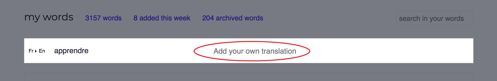

Une fois votre traduction entrée, tapez sur la touche `entrée` pour enregistrer le mot. 

#### Trier les mots

Pour trier vos mots, cliquez sur la colonne correspondant à l'index de tri qui vous convient. Cliquez une nouvelle fois pour trier dans l'ordre descendant.

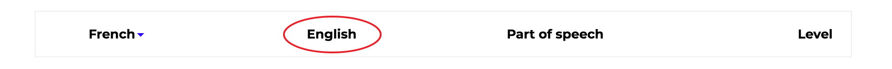

#### Retourner sur les mots

Depuis n'importe quelle page du site, retrouvez vos mots en cliquant sur `MOTS` dans la barre de menu sur la gauche :

### Réviser vos mots

*Le fait de réviser vos mots va vous permettre de les acquérir définitivement afin de pouvoir les comprendre lorsque vous retomberez dessus et de pouvoir les réutiliser quand vous parlez et écrivez.*

#### Aller sur la partie révision

Si vous avez des mots à réviser, un bouton va apparaître en haut de votre écran. Cliquez dessus pour réviser vos mots.

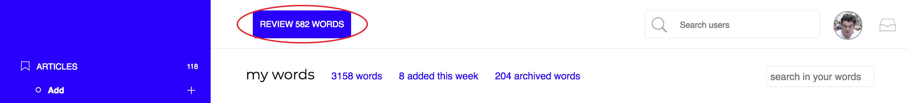

#### Révisez un mot

Pour réviser un mot, tapez sa traduction dans la zone de saisie en dessous. 

!> :bulb: __Astuce__   La largeur de la zone de saisie correspond à celle du mot attendu, vous pouvez donc déterminer quelle traduction nous attendons de vous. Ici `rigid` ou `stiff` seraient trop courts, au contraire le sens figuré `hidebound` fait la bonne longueur est doit être la traduction attendue.  

#### Options de révision

Sous la zone de saisie, vous pouvez voir plusieurs options :

* L'icône `crayon` :pencil2: vous permet d'éditer un mot, il n'est activable qu'après qu'un mot a été révisé.

* L'icône `flèches gauche et droite` :left_right_arrow: vous permet de changer le sens de révision.

* L'icône `bouée` :o: vous donne en indice la première et la dernière lettre du mot attendu. 

 
*ici ça doit être `springboard`...*

* L'icône `œil` :eyes: cache les mots de niveau 0, pour que ce ne soit pas trop simple.

|  |  |
| --- | --- |
| **visible** :speak_no_evil: | **invisible** :see_no_evil: |

 

* L'icône `flèches emmêlées` :twisted_rightwards_arrows: vous permet de réviser en mode aléatoire et non plus suivant notre algorithme de répétition espacée.

* L'icône `poubelle` :put_litter_in_its_place: supprime le mot que vous êtes en train de réviser (parce que vous le connaissez déjà ou parce que vous en avez envie).

*Quand c'est possible, recliquer sur l'icône provoquera le comportement inverse.*

#### Statistiques d'une session de révisions

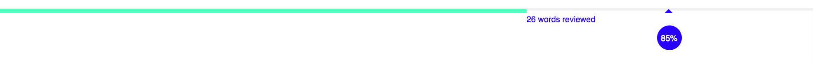

La ligne verte vous indique la part des mots que vous avez déjà révisés. Plus elle s'approche de la droite de l'écran, plus la fin de la session est proche. 

Le pourcentage dans la bulle bleu vous donne votre taux de succès.

#### À propos de notre système de niveau.
 
?> :information_desk_person: __info__  Les mots ont des niveaux allant de 0 (inconnu) à 5 (maîtrisé). Le niveau d'un mot correspond à la connaissance que vous en avez et est déterminé par vos révisions consécutives de celui-ci. À chaque fois que vous avez bon à une révision le niveau s'incrémente, à chaque vois que vous vous trompez le niveau redescend. Plus vous connaissez un mot, moins vous aurez besoin de le réviser ; pour cette raison, notre algorithme de répétition espacée insistera sur les mots que vous connaissez le moins et les mots mieux connus apparaitront moins pendant les sessions de révisions.

### Les listes

*Les listes sont là pour vous aider à organiser vos mots.*

#### Créer une liste

Pour créer une liste, cliquez sur `Listes` comme montré ici:

1. Donnez lui un nom.
2. Cliquez sur créer liste.

Parfait, vous avez votre première liste.

#### Consulter une liste.

Votre nouvelle liste doit être apparue sous le mot `Listes` dans votre menu. Pour le moment, elle ne contient pas de mots. Cliquez sur son nom pour aller sur la liste. 

#### Remplir une liste

##### Depuis la page de la liste

Ici, on retrouve un schéma proche de celui connu au moment de l'ajout de mot. Le fonctionnement est le même mais les mots ajoutés ici seront aussi inclus à la liste consultée. 

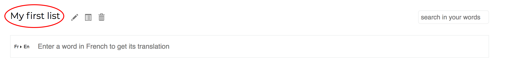

##### Depuis vos mots existants

*Vous pouvez aussi ajouter des mots déjà enregistrés à une liste.*

###### "glisser-déplacer" un mot

Pour se faire, cliquez sur le mot que vous voulez mettre dans une liste et, en maintenant votre clic, déplacez-le sur le nom de la liste dans laquelle vous désirez le mettre. Quand le mot arrivera sur le nom de la liste concernée, cette dernière va bouger légèrement pour vous indiquer que vous êtes arrivé(e) à destination : vous pouvez alors relâcher votre clic.

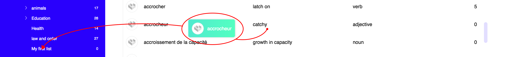

###### "glisser-déplacer" plusieurs mots

Vous pouvez aussi "glisser-déplacer" plusieurs mots à la fois. Pour sélectionner un mot, cliquez sur sa ligne, celle-ci va se griser. 

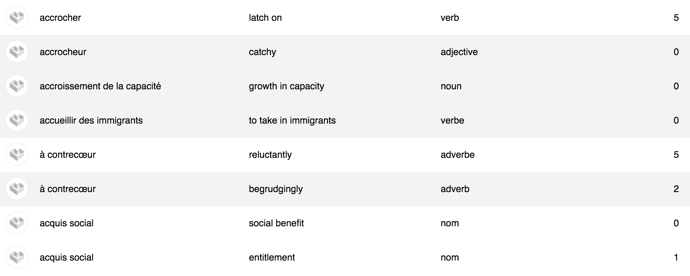

Quand vous avez selectionné tous les mots que vous voulez mettre dans votre liste, cliquez sur n'importe lequel des mots et effectuez votre "glisser-délplacer" comme expliqué précédemment. 

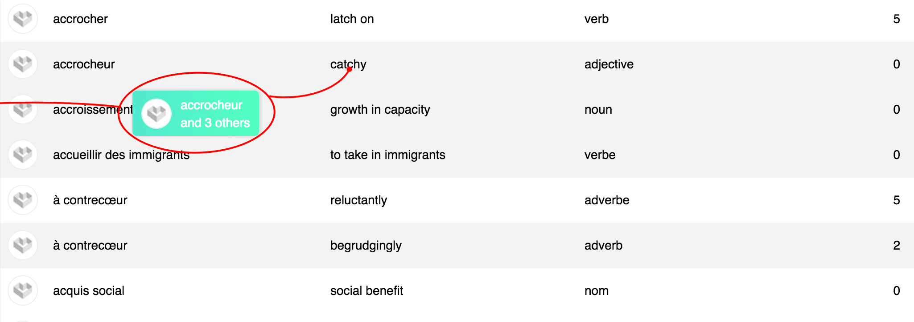

Pour désélectionner un mot, recliquez sur sa ligne. 

#### Réviser une liste

Pour réviser une liste, cliquez sur le bouton `RÉVISER LISTE` que vous trouvez en haut de la page lorsque vous vous trouvez sur une page de liste.

#### Plus loin avec les listes

##### Options des listes

Quand vous consultez une liste, vous avez des options à côté du nom de la liste :

* Le `crayon` :pencil2: vous permet de renommer la liste.

* L'icône `listes` :clipboard: permet de créer des sous-listes, pour les plus organisé(e)s d'entre vous.

* La `poubelle` :put_litter_in_its_place: permet de supprimer une liste. À utiliser avec précaution.

##### Menu contextuel

Dans la barre de menu à gauche, si vous cliquez droit sur le nom d'une liste un menu contextuel apparaît :

Comme les actions sont particulièrement explicites, nous vous laissons le soins de les déterminer par vous même.

##### "glisser-déplacer" des listes dans des listes

De la même manière que vous pouvez glisser-déplacer des mots dans les listes, vous pouvez glisser-déplacer des listes dans des listes pour les fusionner ou les imbriquer. 

Quand vous lâchez une liste sur une autre liste un panneau apparaît : 

* **Fusionner** veut dire que les mots de `Society` vont être incorporés à `Politics`. Il vous sera possible de renommer la liste `Politics` ensuite. 

* **Imbriquer** veut dire que `Society` va devenir une sous-liste de `Politics`.

### Les articles

*La partie article sert à stocker les articles dans votre langue d'apprentissage qui vous intéresse, notamment pour les lire plus tard.*

#### Aller dans la partie articles

Vous pouvez trouver votre partie articles dans la barre de menu :

#### Ajouter des articles

Pour ajouter un article, cliquez sur `ajouter`.

Puis collez le lien de l'article que vous voulez ajouter et cliquez sur "entrer":

Votre article a été ajouté.

#### Lire un article

Cliquez sur le titre ou sur l'image miniature pour lire l'article en mode lecture zen.

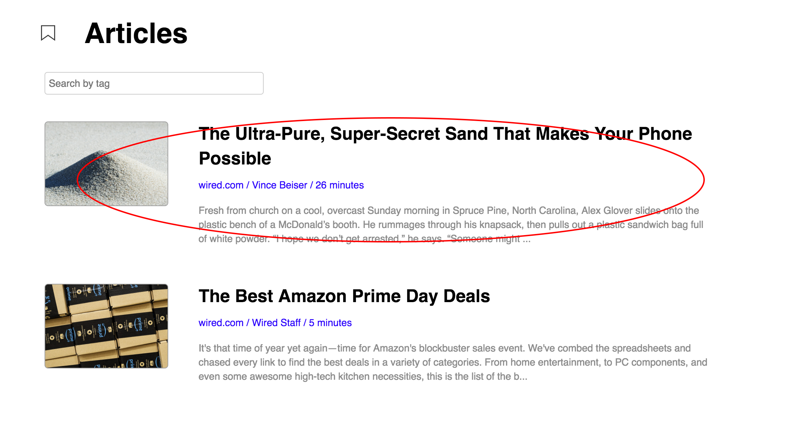

Maintenant, vous devriez être en train de lire l'article que vous avez ajouté : 

##### Traduire des mots tout en lisant

Maintenant que vous lisez, imaginons que vous tombiez sur un mot que vous ne connaissez pas, par exemple `overcast` dans la première ligne :

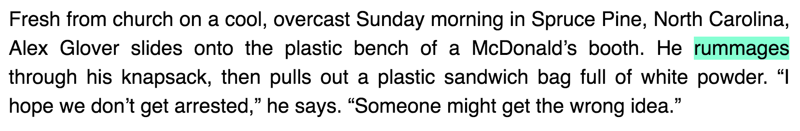

Pour le traduire, double-cliquez dessus, ou sélectionnez le texte à traduire, la traduction de celui-ci va être proposée directement au sein de la page. 

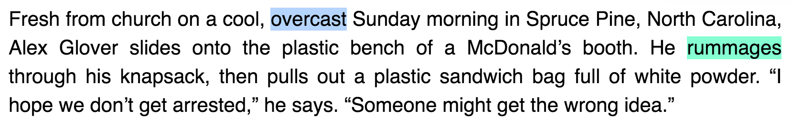

| Cela déclenche le traducteur : | Cliquez sur les traductions pour les enregistrer :|
| --- | --- |
|  |  |

 

Vous avez toujours la possibilité d'ajouter vos propres traductions. Vous vous souvenez ? Cliquez sur la zone de saisie réservée à cet effet et mettez y votre traduction.

##### Révision au sein des articles

Si vous avez déjà des mots enregistrés, il y a des chances que vous tombiez sur des mots surlignés au cours de votre lecture, comme ici :

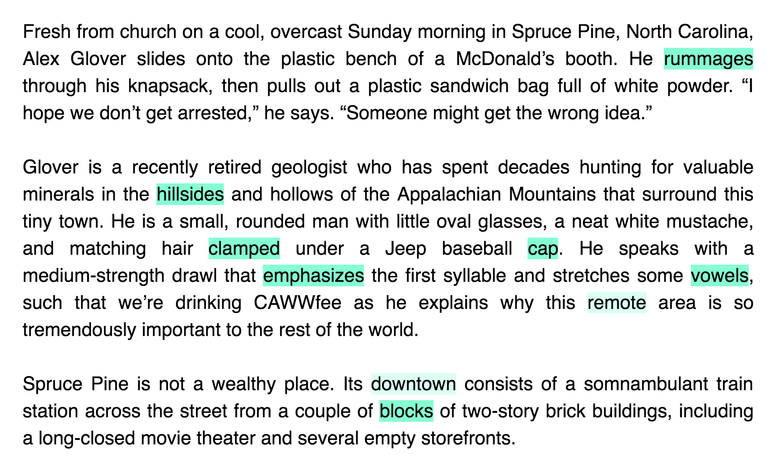

Ces mots sont ceux que vous êtes en train d'apprendre et que vous avez besoin de réviser. Essayons de cliquer sur `rummages` pour le réviser.

?> :information_desk_person: __info__  Certains mots dans le texte précédent sont des formes conjuguées de verbes (e.g. `rummages` ou `clamped`), d'autres sont des formes pluriels de noms (e.g. `hillsides`, `vowels`). En fait, lorsque vous traduisez une forme d'un mot, nous vous proposons en général sa forme la plus simple (infinitif/singulier) mais nous surlignons ensuite toutes les formes existantes lorsque vous tombez dessus au cours de votre navigation. De cette manière, vous ne râtez aucune opportunité de réviser vos mots. Dans les exercices, nous vous demandons en général les formes infinitives/singulières, ici `rummage` pour `rummages`. Aussi, nous essayons de ne surligner les mots que lorsqu'ils sont dans le bon contexte : si vous apprenez un mot en tant que verbe mais que vous tombez sur celui-ci utilisé comme adjectif, il ne sera pas surligné. 

?> :information_desk_person: __info__  Certains mots, à l'instar de `remote` ou de `downtown` sont surlignés de manière moins marquée. Cela signifie que vous êtes en train de les apprendre mais que nous ne jugeons pas qu'il soit nécessaire de les réviser à l'instant t car vous les avez revus suffisamment récemment. Passez votre souris dessus pour obtenir un rappel de leur traduction. 

### Visiter le profil d'autres utilisateurs

Si vous connaissez le nom d'utilisateur de certains de vos amis, vous pouvez les rechercher dans la barre de recherche prévue à cet effet:

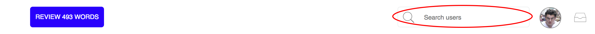

Une fois sur leur profil, vous serez en mesure d'ajouter leurs mots et de copier leurs listes.

#### Ajouter leurs mots

Pour ajouter un mot, cliquez sur la croix verte à droite de sa ligne.

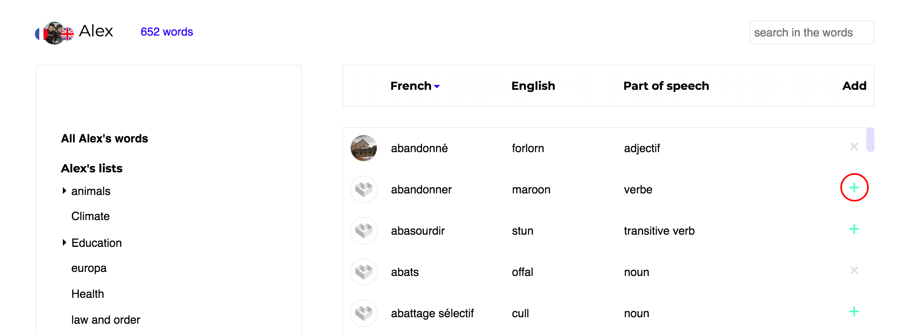

#### Copier leurs listes

Pour voir le contenu d'une liste, cliquez sur son nom. Si vous désirez l'ajouter, positionnez-vous sur son nom avec votre curseur, une icône apparaît qui signifie `copier cette liste`. Cliquez dessus. Et voilà.

#### Glisser-déplacer

Vous pouvez aussi glisser-déplacer des mots ou des listes directement dans une de vos listes comme vu précédemment. 

### Pour les professeurs et les classes

#### Les comptes professeurs

*Les comptes professeurs sont des comptes spécifiques qui laissent les professeurs partager leurs contenus avec leurs étudiants (articles, listes et mots) et qui leur permettent de suivre les progrès de ceux-ci.*

Si vous avez un compte professeur, vous serez en mesure de voir vos classes en dessous de vos listes :

Si vous voulez voir toutes vos classes, cliquez sur `CLASSES`. Si vous voulez voir les étudiants d'une classe en particulier, cliquez sur son nom. 

Lorsque vous cliquez sur `CLASSES`, vous arrivez sur une page de partage :

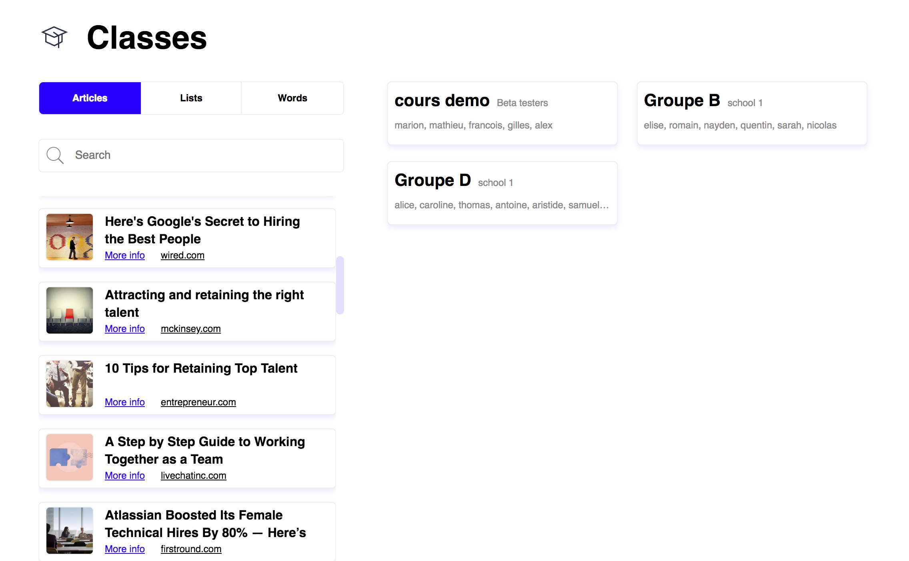

Vous pouvez choisir les choses que vous voulez partager en cliquant sur le bon onglet :

Et de nouveau, un glisser-déplacer vous permettra de partager vos mots/listes/articles avec le groupe de votre choix.

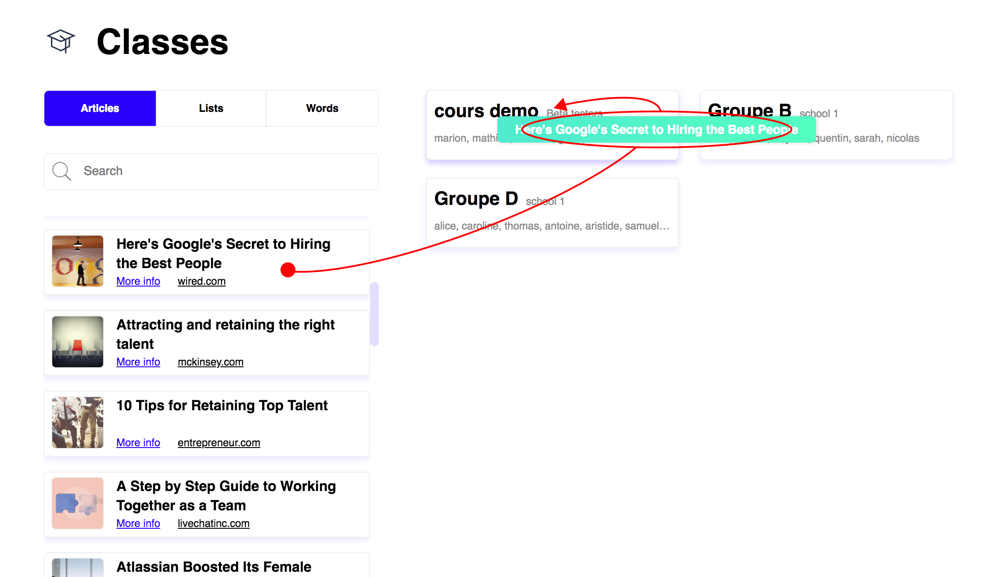

Lorsque vous cliquer sur un des groupes, vous pouvez partager du contenu avec des élèves en particulier et vous pouvez aussi voir l'usage qu'ils ont eu de la plateforme :

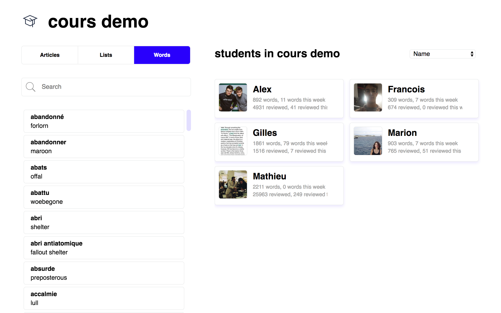

#### Compte étudiant

*Les utilisateurs qui font partie d'une classe peuvent partager leurs contenus avec leurs camarades.*

Pour partager une liste, cliquez droit sur son nom dans le menu, puis cliquez sur `partager liste`, vous devrez ensuite choisir si vous voulez la partager avec toute la classe ou seulement avec quelques élèves. Si vous partagez quelque chose avec toute la classe, le professeur de celle-ci le recevra aussi. 

De la même manière, vous pouvez sélectionner des mots et les partager avec vos camarades de classe.

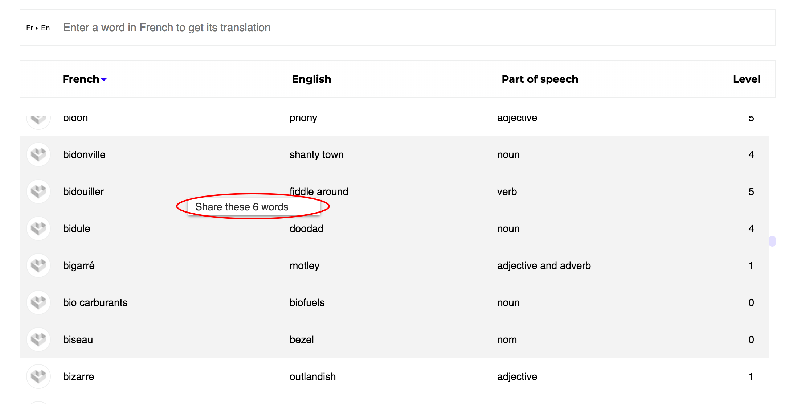

# Extensions

## Installer une extension

*Nos extensions sont disponibles sur Chrome, Firefox, et Safari.*

Si vous n'avez pas encore installé notre extension, voici les liens auxquels vous pouvez la trouver:

[Pour Chrome](https://chrome.google.com/webstore/detail/languagesai-extension/ocjbabgnfnblhgpddnnlhccmihnlombj ":ignore title") - [Pour Firefox](https://addons.mozilla.org/fr/firefox/addon/languages-ai-extension/ ":ignore title") - [Pour Safari](https://safari-extensions.apple.com/details/?id=www.languages.ai-Q6TC99QXA7 ":ignore title")

Lorsque vous l'avez installée, elle doit apparaître dans votre barre d'outil, comme ici sur Chrome. Si l'icône est bien là et qu'elle est bleue, cela veut dire que vous êtes bien connecté(e) à votre compte.

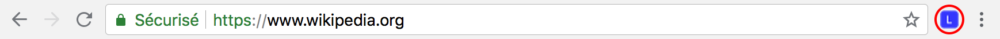

## Traduction

Cliquez sur l'icône pour ouvrir le traducteur depuis n'importe quelle page web. Vous pouvez alors traduire ce que vous voulez.

 * Si vous cliquez sur la flèche vers la bas :arrow_down_small: à côté de votre langue d'apprentissage, vous pouvez changer la langue dans laquelle vous êtes en train de traduire (parmi celles que vous apprenez).

 * Si vous cliquez sur les flèches à double sens :left_right_arrow:, vous inversez le sens de traduction (i.e. en partant de votre langue d'apprentissage au lieu de votre langue natale par exemple).

 * Si vous avez déjà des listes vous pouvez cliquer sur `No list selected` et sélectionner une de vos listes avant d'enregistrer un mot. Votre mot sera alors inclu à la liste sélectionnée.

 * Cliquez sur l'icône de `marque-page` en haut à droite du traducteur pour enregistrer dans vos articles la page que vous visitez.

 * Cliquez sur l'icône `son` :sound: pour écouter le mot que vous traduisez.

Les traductions, surlignements et processus de révision fonctionnent de la même manière que dans [la partie article](fr/?id=traduire-des-mots-tout-en-lisant) de la plateforme web.

## Recommandation

Parfois, pendant que vous lisez dans votre langue maternellele, nous vous recommandons des pages dans votre langue d'apprentissage afin que vous puissiez lire des choses qui vous intéressent tout en vous améliorant en langues.

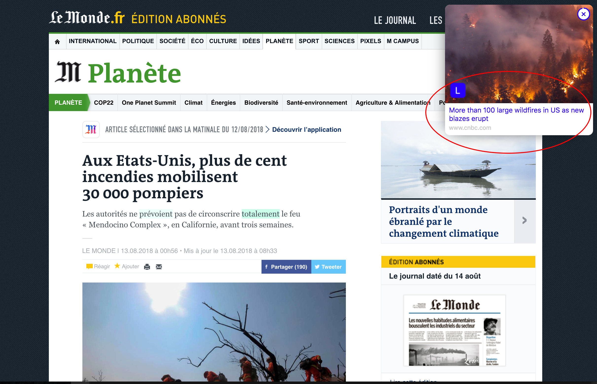

Une petite fenêtre va s'ouvrir dans votre onglet, cliquez dessus pour ouvrir l'article dans un nouvel onglet.

!> :bulb: __Astuce__   Si vous voulez changer certains comportements de l'extension, vous pouvez accéder à la page d'options en cliquant-droit sur l'icône de l'extension puis en cliquant sur `Options`  

